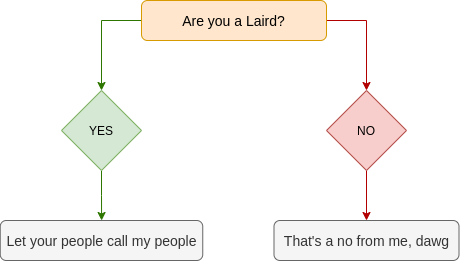

# DocBook snippets extension

_I can't even DocBook!_

This simple extension is manna from heaven that makes working with DocBook less tedious. Unless you are not using VSCodium or Visual Studio Code. Then it's still tedious.

## Features

 - Turns DocBook into an endless source of joy
 - Brightens your day
 - Makes you a better person

## Regulatory approval

Approved for use by the Laird of Glencoe and Kilnaish.

## Can I contribute?

## Release notes

Here is what's new.

### 0.0.1

Initial release

